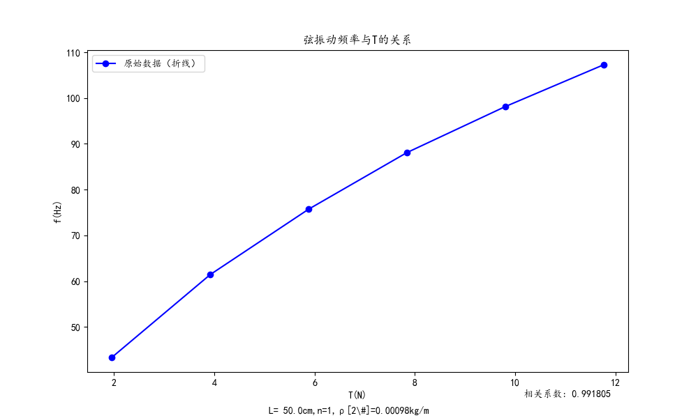
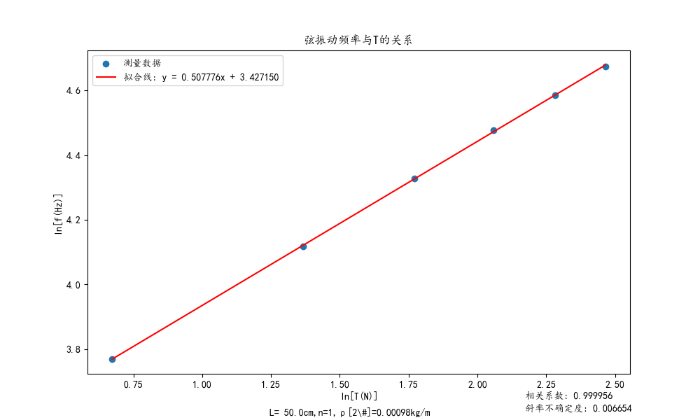

# data-to-tex：数据拟合与可视化工具

## 概述

大学物理实验：由原始数据生成拟合图像与tex报告。

该项目是我为物理实验课数据分析编写的。

这个项目提供了一个 Python 脚本，用于读取 `.txt` 格式的数据文件，进行线性最小二乘拟合，并生成相应的图像和 LaTeX 代码。该脚本还支持多次测量的数据并计算其不确定度。

执行命令后可以得到`.tex`文件，在最终的报告文件中使用`\input{XX.txt}`即可

## 功能

- 数据读取：从指定的 `.txt` 文件中读取数据。
- 线性拟合：对 x, y 轴数据进行线性最小二乘拟合。
- 数据可视化：生成拟合后的图像并保存为 `.png` 格式。
- 不确定度计算：对于多次测量的数据，计算 y 轴数据的不确定度。
- LaTeX 代码生成：自动生成包含原始数据和图像的 LaTeX 代码，利用哈希函数给予label编号。
- 命令行参数支持：通过命令行参数指定输入文件和拟合选项。

## 依赖

Python:
- Python 3.x
- NumPy
- Matplotlib

Latex:
- hyperref
- amsmath
- graphicx

## 使用方法

1. 将你的数据保存在 `.txt` 文件中，格式如下：

    ```
    表头
    其他事项
    x轴名称:数据1 数据2 ...
    y轴名称:数据1 数据2 ...
    (y轴名称:第二次测量数据 ...)
    [可选]不确定度Delta_B
    x的精度 y的精度
    ```

2. 运行脚本：

    ```
    python script.py 数据文件.txt [选项]
    ```

    其中 `[选项]` 可以为：

    - `1`：原始数据，对 y - x 线性拟合（默认）。
    - `2`：原始数据取自然对数，对 ln y - ln x 线性拟合。
    - `3`：原始数据取倒数，对 y - 1/x 线性拟合。

## 输出

- 一个 `.png` 格式的图像文件，显示拟合结果。
- 一个 `.tex` 文件，包含原始数据表格和图像的 LaTeX 代码。

## 示例

假设有一个名为 `data.txt` 的数据文件，执行以下命令：

```shell
python plot.py data.txt 2
```

该脚本将生成一个名为 `data.png` 的图像文件和一个名为 `data.tex` 的 LaTeX 文件。

详见`demo`中的结果，可以处理3种拟合方式、是否计算不确定度的六种组合。

生成的图片：


